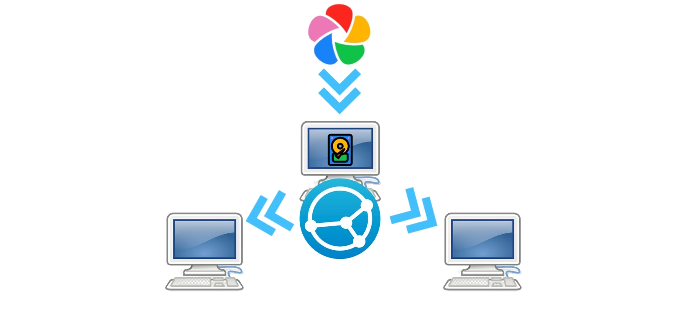
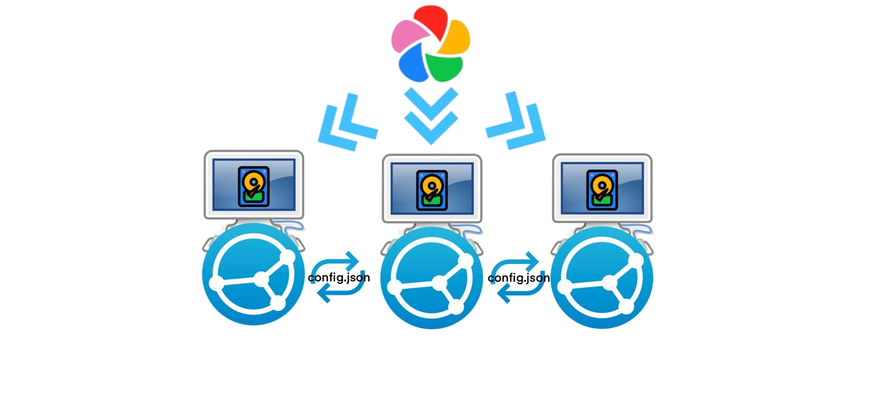

   

# immich-back-up-tool
A simple tool to back up Immich via API
Has only been tested on Linux
Was not made to work with Windows

# Getting Started
You will need to install go and exiftool
You will want to copy the contents of the 'sample-config.json' file to a new file called 'config.json'
Within this new config.json file you will want to supply each value being requested.

> [!NOTE]
> You can change the download location to THIS_LOCATION, this will save the photos to outside the project folder under immichPhotos.
> Changing the location of main.go from immich-back-up-tool/src/main.go will cause the application to behave unintendedly. The logic behind THIS_LOCATION moves two directories up and saves the files there.


To run this application, navigate to the 'src' and run the following:

```
go run main.go
```

You can also build this application with 

```
go build main.go
```


# Informational
this project accepts arguments
-h prints out the possible arguements
-d "mm-dd-yyyy" starts the sync at the entered user date
-Y this is for when you want to use THIS_LOCATION without having to confirm. I do not recommend this unless you are certain where the photos will be saved. They will be saved ../../immichPhotos (two folders up from main.go/main in a new folder called immichPhotos). Intended use: for dedicated backup set ups and start up scripts.

The initial run will take a while depending on how many files you have backed up to Immich

## The initial steps will be as follows
1. Create a database
1. Get everything after 1970 until this date. I may split this up better but right now this is the plan.

## Normal Procedure.
1. See most recent sync dtm in database
1. Pull everything since the last sync date
1. Add entry to database
1. Done

> [!NOTE]
> You will see 'Downloading file number n/d+' when you start to download
> If you are downloading more than 250 photos the denominator will be 250 until the last page.
> This is because the total variable returned from the Immich API does not currently return the total number of assets in the request. I have made a [discussion](https://github.com/immich-app/immich/issues/25325) post and it looks like they are planning to remove 'total' from the response.

# Further Backups
I have thought about 2 additional possible avenues.
1. Use Syncthing to copy your photos from a single device through Syncthing

   

2. Use Syncthing to copy your config.json between computers.


   


Possible drawbacks to option 1, if your main Syncthing node dies you will need to recreate the node and recreate you db.

Possible drawbacks to options 2, you will be making your Immich server send X times more data for saving your back ups.


## TODOS:
1. make the output prettier
1. move functions to separate files
1. add location data
